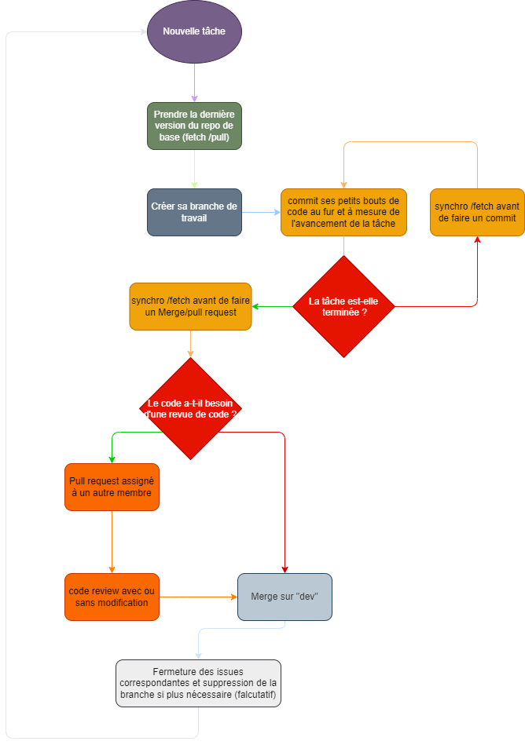

# frontend-collab-chat-project
Frontend for the collaborative project of a chat app.

## Conventions de nommage

Pour garder une certaine constance dans le code source, voici les quelques règles à respecter lors du développement et de la maintenance de l'appli webFdl :
### Concernant les noms de fonctions 
- Les noms doivent être en anglais
- ils doivent respecter le camelCase (lesMotsSontAttachésEnsembleSansEspaceAvecLaPremièreLettreEnMajusculeSaufPourLePremierMot)
- ils se composent d'un verbe d'action pertinent et d'un ou deux noms.
  => si 2 noms, le premier décrit l'objet et le second sa fonction

Exemple: Le nom pour une fonction qui affiche le contenu d'un tableau de données pourrait donner : displayArrayDatas

### Concernant les composants
- ils doivent être en anglais
- ils doivent respecter le kebab-case (les-mots-sont-reliés-ensemble-par-un-tiret-et-sans-majuscule)
- Le nom doit terminer par "page" s'il s'agit d'un composant qui gère l'affichage d'une vue et doit se trouver dans le dossier pages
- sinon, ils se trouvent dans le dossier "components"

## Travail collaboratif avec Github
- La branche "main" est la branche principale de l'appli. Elle ne sert qu'a pousser les fonctionnalités complètes et sans bug connu. C'est la branche qui sera lancée en production. Aucun commit n'est à effectué directement dessus.
- La branche "dev" est la branche principale à utiliser lors de la phase de développement de l'appli. Tout comme "main", on ne doit pas faire de commit directement dessus. Lorsque l'on merge une branche de travail dessus, on doit s'assurer que la tâche est terminée (pas de code incomplet ou non fonctionnel) et qu'elle n'entraîne pas de bug connu.
- les branches de travail : Elles sont crées à partir de la branche "dev" lors d'une nouvelle tâche et ne doit contenir que les commits en rapport avec la tâche pour laquelle elle a été créé. Elle doit respecter une convention de nommage ainsi que certaines bonnes pratiques expliquées ci-dessous.
### Convention de nommage
- Les branches sont écrites en anglais et en kebab-case (les-mots-sont-reliés-ensemble-par-un-tiret-et-sans-majuscule).
- l'intitulé de la branche se compose de 2 parties : le type de tâche à coder (parmi 
    - ``feat`` => fonctionnalité,
    -  ``bugfix`` => correction de bug,
    -  ``refacto`` => refactorisation pour lisibilité/maintenabilité,
    -  ``test`` => essai à but temporaire,
    -  ``docs`` => documentation/commentaire,
    -  ``style`` => design/expérience utilisateur,
    -  ``perf`` => performance de l'appli) 
    et une description de la tâche. 
    
    Exemples : ``feat-new-view-workload-allocation`` / ``perf-improvement-response-time-workload-request``

### Fonctionnement du versioning collaboratif
Voici un schema illustrant le fonctionnement du développement grâce à Git :

### Extensions utiles pour VSCode
- ``Conventional Commits`` => permet de structurer et uniformiser les commits
- ``Git Cheatsheet`` => Utile pour avoir toujours les commandes git à portée de main
- ``Git Graph`` => Représentation plus graphique de l'arborescence du versionning
- ``GitHub Pull Requests and Issues`` => Permet de travailler sur les issues directement depuis VSC et de les intégrer aux commits pour une meilleure traçabilité
- ``GitLens`` => Ensemble d'outils pour faciliter la traçabilité des commits 
- ``VS DocBlockr`` => Permet de commenter et définir les types pour les fonctions, variables etc...
- ``Mintlify Doc Writer for Python....`` => Permet de générer automatiquement un commentaire basique pour le morceau de code sélectionné
- ``Todo Tree`` => Permet de laisser des annotations dans le code sur des choses à faire, débugger pour y accéder plus facilement
- ``Prettier`` => Permet de formater le code (document entier ou morceau sélectionné) pour obtenir un code plus lisible
- ``ESLint`` => Permet de mettre en place des règles pour uniformiser le code pour tous les collaborateurs
- ``MySQL`` => Donne un accès à la bdd depuis VSC
- ``Draw.io Integration`` => Permet de créer /lire des schémas (use case, user story, schema fonctionnel, technique, etc...)
